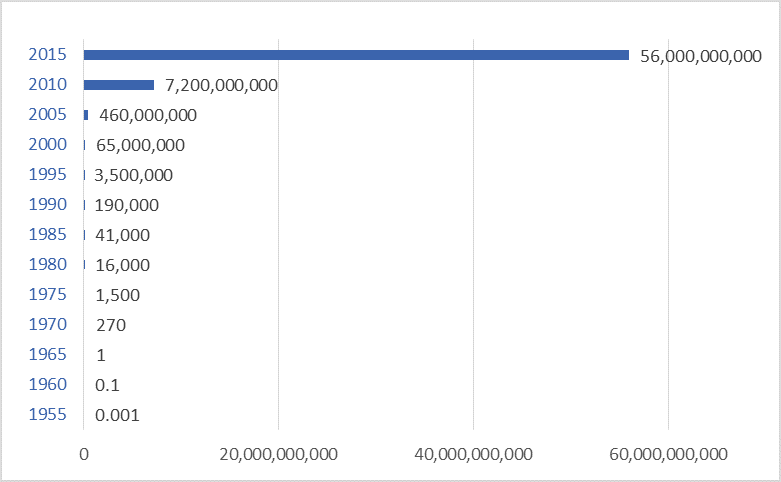
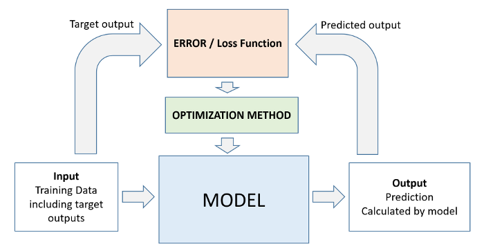
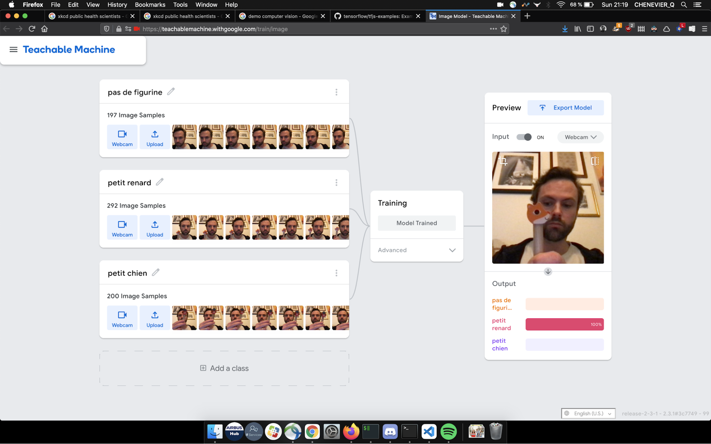
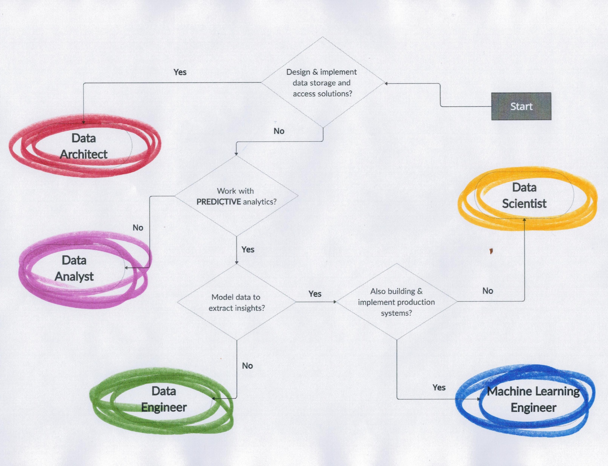
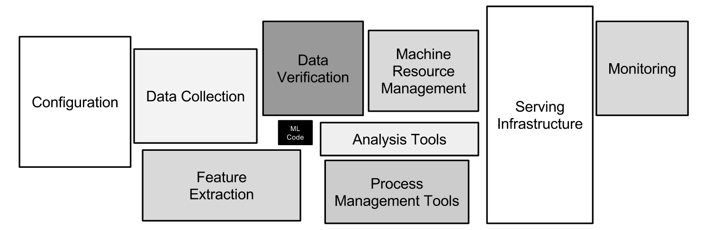

# 1 - Introduction

## Data is eating the world 

### Envisioning the future

To understand the future, look at weak signals with exponential growths.

What are those weak signals ?

<figure markdown>
{width=80% .center}
<figurecaption><small>Source: [@vb_jens](https://twitter.com/vb_jens/)</small></figurecaption>
</figure>

### Cheap computing

Computing power per $ = x2 every 18 months

<figure markdown>

<figurecaption><small>Source: [Moore's Law over 120 Years (Ray Kurzweil)](https://commons.wikimedia.org/wiki/File:Moore%27s_Law_over_120_Years.png)</small></figurecaption>
</figure>

### Ubiquitous computing

Transistors per human = x10 every 5 years

<figure markdown>
{width=80% .center}
<figurecaption><small>Source: [Darrin Qualman](https://www.darrinqualman.com/global-production-transistors/)</small></figurecaption>
</figure>

### Growing data

Data stored = x5 every 4 years

400 exaBytes = 40 GB/human

40 000 exaBytes = 4 TB/human

<figure markdown>
{width=80% .center}
<figurecaption><small>Source: [The Digital Universe in 2020 (IDC)](https://www.cs.princeton.edu/courses/archive/spring13/cos598C/idc-the-digital-universe-in-2020.pdf)</small></figurecaption>
</figure>

### Slow growth of IT jobs

Slow growth of number of technologists in the population.

Non-exponential !

<figure markdown>
{width=80% .center}
<figurecaption><small>Source: [Employed ICT specialists (Eurostat by DB nomics)](https://db.nomics.world/Eurostat/isoc_sks_itspt?dimensions=%7B%22FREQ%22%3A%5B%22A%22%5D%2C%22geo%22%3A%5B%22FR%22%2C%22DE%22%2C%22IT%22%2C%22ES%22%2C%22UK%22%5D%2C%22unit%22%3A%5B%22PC_EMP%22%5D%7D&tab=chart)</small></figurecaption>
</figure>

### Big data is eating the world

IT & Engineering departments are forced to get into cloud, big data and machine learning.

<figure markdown>
{width=80% .center}
<figurecaption><small>Source: [The Business Imperatives - EMC](https://www.emc.com/leadership/digital-universe/2014iview/business-imperatives.htm)</small></figurecaption>
</figure>

### Information brings value by improving decisions

A weather forecast is not valuated the same by a citizen and by a wine producer.

The assessment of oil reserves is not valuated the same by a citizen and by a trader on the commodity market.

AI creates information which is exploited through decisions.

You can't leverage AI without understanding decision making !

<big>**📊 Information + ✋ Decision = 💰 Value**</big>

## What is AI

### The 3 eras of AI

AI has embraced very different technologies during its history:

1. **classical code**
    if → then → else
1. **expert system**
    using human-made rules
1. **statistical algorithms**
    machine learning the rules

<figure markdown>
{width=80% .center}
<figurecaption><small>Source: [State-of-the-Art Mobile Intelligence (research paper)](https://www.researchgate.net/publication/323591839_State-of-the-Art_Mobile_Intelligence_Enabling_Robots_to_Move_Like_Humans_by_Estimating_Mobility_with_Artificial_Intelligence)</small></figurecaption>
</figure>

### AI is machine learning

Knowledge is extracted from data. Machine learning is a combination of:
- statistical algorithms
- systematic experimental process

Basically, it's experimentation with algorithms.

<figure markdown>
{width=50% .center}
<figurecaption><small>Source: [xkcd](https://xkcd.com/1838/)</small></figurecaption>
</figure>

### Principles of machine learning

The model computes predictions. E.g:
- linear regression
- decision trees
- SVM
The optimizer tunes the model to reduce the prediction error. E.g:
- gradient descent
- genetic algorithms

<figure markdown>
{width=80% .center}
<figurecaption><small>Source: [From Linear Regression to Deep Learning in 5 Minutes](http://www.deepnetts.com/blog/from-linear-regression-to-deep-learning-in-5-minutes.html)</small></figurecaption>
</figure>

### Differentiable programming

Machine learning by gradient descent is an optimisation of a differentiable function:
- A differentiable function allows to compute the error gradient
- Each iteration, the gradient shows how to modify the model parameters to reduce the error.

<figure markdown>
{width=80% .center}
<figurecaption><small>Source: [Linear Regression by using Gradient Descent Algorithm: Your first step towards Machine Learning (medium)](https://medium.com/meta-design-ideas/linear-regression-by-using-gradient-descent-algorithm-your-first-step-towards-machine-learning-a9b9c0ec41b1)</small></figurecaption>
</figure>

??? note
    If the function we want to optimize is not differentiable, we use other optimization algorithms (such as random search, genetic algorithms, bayesian optimization, ...), it is then called *black box optimization*.

### Demo: Interactive linear regression

[👉 Interactive linear regression – GeoGebra](https://www.geogebra.org/m/xC6zq7Zv)

<figure markdown>
{width=80% .center}
<figurecaption><small>Source: [Interactive linear regression – GeoGebra](https://www.geogebra.org/m/xC6zq7Zv)
</small></figurecaption>
</figure>

### The deep learning revolution

Simple models (neurons) are combined together to create a complex model.

<figure markdown>
{width=80% .center}
<figurecaption><small>Source: [News Feature: What are the limits of deep learning? (PNAAS)](https://www.pnas.org/content/116/4/1074)</small></figurecaption>
</figure>

### Why deep learning is big deal 

👍 Less preprocessing & feature engineering

👎 Needs much more data 💾 and computing 🥵

<figure markdown>
{width=80% .center}
<figurecaption><small>Source: [Blue Hexagon](https://bluehexagon.ai/blog/what-is-deep-learning-and-how-is-it-different-from-machine-learning/)</small></figurecaption>
</figure>

### Demo: Image classification

[Teachable machine - image model](https://teachablemachine.withgoogle.com/train/image)

<figure markdown>
{width=80% .center}
<figurecaption><small>Source: [Teachable machine - image model](https://teachablemachine.withgoogle.com/train/image)</small></figurecaption>
</figure>

### But deep learning is superficial

Deep learning is cool, but you can't deliver without mastering:
- data collection
- data storage
- data cleaning & preparation
- feature engineering
- simple ML algorithms

Deep learning is less than 5% of data projects in industry.

<figure markdown>
{width=80% .center}
<figurecaption><small>Source: [The AI Hierarchy of Needs](https://hackernoon.com/the-ai-hierarchy-of-needs-18f111fcc007)</small></figurecaption>
</figure>

### Data is the enabler

AI breakthroughs happen thanks to:
- Old algorithms
- New datasets

Data is the true enabler of AI research breakthroughs.

<figure markdown>
{width=80% .center}
<figurecaption><small>Source: [Datasets Over Algorithms (kdnuggets)](https://www.kdnuggets.com/2016/05/datasets-over-algorithms.html)</small></figurecaption>
</figure>

### Careers in big data & AI

<figure markdown>
{width=80% .center}
<figurecaption><small>Source: </small></figurecaption>
</figure>

<figure markdown>
{width=80% .center}
<figurecaption><small>Source: </small></figurecaption>
</figure>

<figure markdown>
{width=80% .center}
<figurecaption><small>Source: </small></figurecaption>
</figure>

<figure markdown>
{width=40% .center}
<figurecaption><small>Source: </small></figurecaption>
</figure>

Forget the ambiguous job names, focus on skills. What are the skills mentioned in a job description ?

### AI Applications in civil aviation

Air traffic conflict detection & resolution

<figure markdown>
{width=60% .center}
<figurecaption>
Air traffic conflict detection & resolution
</figurecaption>
</figure>

Aircraft taxi routing

<figure markdown>
{width=60% .center}
<figurecaption>
Aircraft taxi routing
</figurecaption>
</figure>

ATM workload forecast & ATM sector management

<figure markdown>
{width=60% .center}
<figurecaption>
ATM workload forecast & ATM sector management
</figurecaption>
</figure>

Air traffic planification

<figure markdown>
{width=60% .center}
<figurecaption>
Air traffic planification
</figurecaption>
</figure>

??? note "Links to ENAC/OPTIM team research works"
    - [ENAC/OPTIM – Conference papers](https://haltools.archives-ouvertes.fr/Public/afficheRequetePubli.php?idHal=nicolas-couellan%3Bsonia-cafieri%3Bmarcel-mongeau%3Bdaniel-delahaye%3Bmohammed-sbih%3Balexandre-gondran%3Bdavid-gianazza%3Brichard-alligier%3Bcyril-allignol%3Bnicolas-barnier%3Bnicolas-durand%3Bmurat-bronz%3Bthierry-miquel%3Bantoine-drouin%3Bjean-philippe-condomines%3Bcatherine-mancel%3Bgautier-hattenberger%3Bjean-baptiste-gotteland%3Bandrija-vidosavljevic&typdoc=(%27COMM%27)&CB_auteur=oui&CB_titre=oui&CB_article=oui&CB_DOI=oui&CB_typdoc=oui&langue=Anglais&tri_exp=typdoc&tri_exp2=annee_publi&tri_exp3=auteur_exp&ordre_aff=AT&Fen=Aff&css=../css/VisuRubriqueEncadre.css)
    - [ENAC/OPTIM – Publications](http://optim.recherche.enac.fr/?page_id=81)

## State of the art in AI (deep learning)

Taken from this excellent course: [Deep Learning Lectures](https://m2dsupsdlclass.github.io/lectures-labs/slides/01_intro_to_deep_learning/index.html)

### Speech to text

Waveform → Text

<figure markdown>
{width=80% .center}
<figurecaption>Waveform → Text</figurecaption>
</figure>

### Computer vision

Image → class

Image → (class, bounding box)

Image → (class, shape)

<figure markdown>
{width=80% .center}
<figurecaption>
Image → class 
Image → (class, bounding box) 
Image → (class, shape)
</figurecaption>
</figure>

Image → (class, shape)

Image → facial landmarks

<figure markdown>
{width=80% .center}
<figurecaption>
Image → (class, shape) 
Image → facial landmarks
</figurecaption>
</figure>

### Natural language processing (NLP)

Text → text (different language)

Text → syntax tree

<figure markdown>
{width=80% .center}
<figurecaption>
Text → text (different language) 
Text → syntax tree
</figurecaption>
</figure>

Text → text (probable short answer)

Text → text (query)

<figure markdown>
{width=80% .center}
<figurecaption>
Text → text (probable short answer) 
Text → text (query)
</figurecaption>
</figure>

### Computer vision & NLP 

Image & text (question) → text (answer)

Image → text (description)

<figure markdown>
{width=80% .center}
<figurecaption>
Image & text (question) → text (answer) 
Image → text (description)
</figurecaption>
</figure>

### Image translation

Image → image (with artifacts)

Image → image styled as the other

Image → Image (higher resolution)

<figure markdown>
{width=80% .center}
<figurecaption>
Image → image (with artifacts) 
Image → image styled as the other 
Image → Image (higher resolution)
</figurecaption>
</figure>

### Audio generation

Waveform → Waveform (continued)

<figure markdown>
{width=80% .center}
<figurecaption>
Waveform → Waveform (continued)
</figurecaption>
</figure>

Guess which one is generated ?

<audio controls>
  <source src="columbia_gen.wav" type="audio/wav">
Your browser does not support the audio element.
</audio>

<audio controls>
  <source src="columbia_gt.wav" type="audio/wav">
Your browser does not support the audio element.
</audio>

### Image generation

Vector (random) → image

<figure markdown>
{width=80% .center}
{width=80% .center}
<figurecaption>
Vector (random) → image
</figurecaption>
</figure>

Text → image

<figure markdown>
{width=80% .center}
<figurecaption>
Text → image
</figurecaption>
</figure>

### Science - Genomics, biology, chemistry, physics

DNA sequence → drug

<figure markdown>
{width=80% .center}
<figurecaption>
DNA sequence → drug
</figurecaption>
</figure>

Protein sequence → folding shape (protein properties)

<figure markdown>
{width=80% .center}
<figurecaption>
Protein sequence → folding shape (protein properties)
</figurecaption>
</figure>

Chemical structure → properties

<figure markdown>
{width=80% .center}
<figurecaption>
Chemical structure → properties
</figurecaption>
</figure>

Incompressible Euler equations (Navier-stokes for fluids) → guess of the solution

100x speedup in solving time

<figure markdown>
{width=80% .center}
<figurecaption>
Incompressible Euler equations (Navier-stokes for fluids) → guess of the solution
</figurecaption>
</figure>

### Gaming

Image sequence → next action

<figure markdown>
{width=80% .center}
<figurecaption>
Image sequence → next action
</figurecaption>
</figure>

### More models and tasks

[Papers with Code - Browse the State-of-the-Art in Machine Learning](https://paperswithcode.com/sota)

<figure markdown>
{width=80% .center}
<figurecaption>
Image sequence → next action
</figurecaption>
</figure>

## Not yet state of the art in AI

### AI applications: automation everywhere

All activities are susceptible to be automated, if there is enough data to train models.

The automation equation:
<big>🦾 Automation probability = 🎼 Coherence * 📊 Data</big>

- Coherence: similarity between cases, all configurations are known. We can improve coherence by controlling the environment (ex: battery hens, factory, autonomous driving on private property, prefab in construction)
- Data: the less coherent the environment, the more data we need to describe it (e.g.: driving in Florida on a private property, driving in US, driving in Toulouse).

??? Source
    [WORKING PAPER The Future of Employment](https://www.oxfordmartin.ox.ac.uk/downloads/academic/future-of-employment.pdf) & Q.Chenevier's own opinions

### Perception & manipulation

2 unsolved challenges:

- Perception in unstructured environments: houses, fields
- New or irregular objects handling, with a soft grasp and through learning of mistakes

The human hand is a wonderful tool, full of sensors:

- Position
- Toughness / Roughness
- Heat
- Humidity

<figure markdown>
{width=80% .center}
<figurecaption>
Difficult manipulation environment
</figurecaption>
</figure>

<figure markdown>
{width=80% .center}
<figurecaption>
Difficult perception environment
</figurecaption>
</figure>

<figure markdown>
<iframe width="560" height="315" src="https://www.youtube.com/embed/4F-uu8rvgNw?start=1188" title="YouTube video player" frameborder="0" allow="accelerometer; autoplay; clipboard-write; encrypted-media; gyroscope; picture-in-picture" allowfullscreen></iframe>
<figurecaption>
Manipulation learning experiment (from 19:48 to 21:11)
</figurecaption>
</figure>

### Social intelligence

Social intelligence tasks require several hard-to-automate skills:

- Recognize emotions
- Being empathetic with our interlocutor ("compute its state of mind")
- Exploit this context and the past interactions

*"Recognizing emotions is a challenge, but the ability to answer in a smart way to this information is even harder."*

Nevertheless, Woebot Health: Relational Agent for Mental Health, a CBT (Cognitive Behavioral Therapies) chatbot, demonstrates shows that many CBT therapists' sessions could be automated.

It doesn't replace the therapist, but can reduce significantly the needed amount of sessions to do a therapy.

<figure markdown>
{width=80% .center}
<figurecaption>
Woebot health
</figurecaption>
</figure>

### Creative intelligence
### Creative intelligence

Creative intelligence is about creating new ideas which have a creative value. 

Generating novelty is easy, the main challenge is to know how to describe our creative values to encode them in a software.

<figure markdown>
{width=80% .center}
<figurecaption>
AARON by Harold Cohen
</figurecaption>
</figure>

<figure markdown>
<iframe width="560" height="315" src="https://www.youtube.com/embed/2kuY3BrmTfQ" title="YouTube video player" frameborder="0" allow="accelerometer; autoplay; clipboard-write; encrypted-media; gyroscope; picture-in-picture" allowfullscreen></iframe>
<figurecaption>
EMI by David Cope
</figurecaption>
</figure>

<figure markdown>
{width=80% .center}
<figurecaption>
[AIVA](https://creators.aiva.ai/)
</figurecaption>
</figure>

### Demo: Image generation from text

1. Generate your image with [stable diffusion](https://huggingface.co/spaces/stabilityai/stable-diffusion)
1. Inspire from [prompt examples in diffusionDB](https://huggingface.co/datasets/poloclub/diffusiondb) to create your own prompt
1. Go back to step 1 (loop until having a nice result)

<figure markdown>
{width=60% .center}
<figurecaption>
[stable diffusion](https://huggingface.co/spaces/stabilityai/stable-diffusion
</figurecaption>
</figure>

### Image generation from text prompt: explanation

CLIP: image → text

VQGAN: vector → image

VQGAN+CLIP: vector → image → text

The input (vector) is optimized so that the output (text) matches the text prompt 

<figure markdown>
{width=60% .center}
<figurecaption>
</figurecaption>
</figure>
