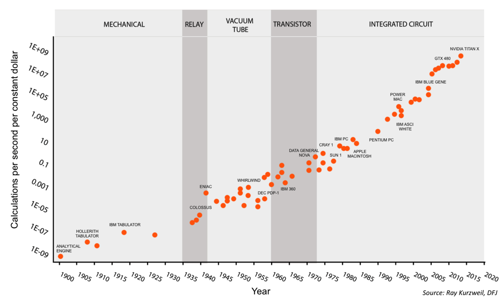

# Data is eating the world 

## Envisioning the future

To understand the future, look at weak signals with exponential growths.

What are those weak signals ?

<figure markdown>
{width=80% .center}
<figurecaption><small>Source: [@vb_jens](https://twitter.com/vb_jens/)</small></figurecaption>
</figure>

## Cheap computing

Computing power per $ = x2 every 18 months

<figure markdown>

<figurecaption><small>Source: [Moore's Law over 120 Years (Ray Kurzweil)](https://commons.wikimedia.org/wiki/File:Moore%27s_Law_over_120_Years.png)</small></figurecaption>
</figure>

## Ubiquitous computing

Transistors per human = x10 every 5 years

<figure markdown>
{width=80% .center}
<figurecaption><small>Source: [Darrin Qualman](https://www.darrinqualman.com/global-production-transistors/)</small></figurecaption>
</figure>

## Growing data

Data stored = x5 every 4 years

400 exaBytes = 40 GB/human

40 000 exaBytes = 4 TB/human

<figure markdown>
{width=80% .center}
<figurecaption><small>Source: [The Digital Universe in 2020 (IDC)](https://www.cs.princeton.edu/courses/archive/spring13/cos598C/idc-the-digital-universe-in-2020.pdf)</small></figurecaption>
</figure>

## Slow growth of IT jobs

Slow growth of number of technologists in the population.

Non-exponential !

<figure markdown>
{width=80% .center}
<figurecaption><small>Source: [Employed ICT specialists (Eurostat by DB nomics)](https://db.nomics.world/Eurostat/isoc_sks_itspt?dimensions=%7B%22FREQ%22%3A%5B%22A%22%5D%2C%22geo%22%3A%5B%22FR%22%2C%22DE%22%2C%22IT%22%2C%22ES%22%2C%22UK%22%5D%2C%22unit%22%3A%5B%22PC_EMP%22%5D%7D&tab=chart)</small></figurecaption>
</figure>

## Big data is eating the world

IT & Engineering departments are forced to get into cloud, big data and machine learning.

<figure markdown>
{width=80% .center}
<figurecaption><small>Source: [The Business Imperatives - EMC](https://www.emc.com/leadership/digital-universe/2014iview/business-imperatives.htm)</small></figurecaption>
</figure>

## Information brings value by improving decisions

A weather forecast is not valuated the same by a citizen and by a wine producer.

The assessment of oil reserves is not valuated the same by a citizen and by a trader on the commodity market.

AI creates information which is exploited through decisions.

You can't leverage AI without understanding decision making !

<big>**📊 Information + ✋ Decision = 💰 Value**</big>
