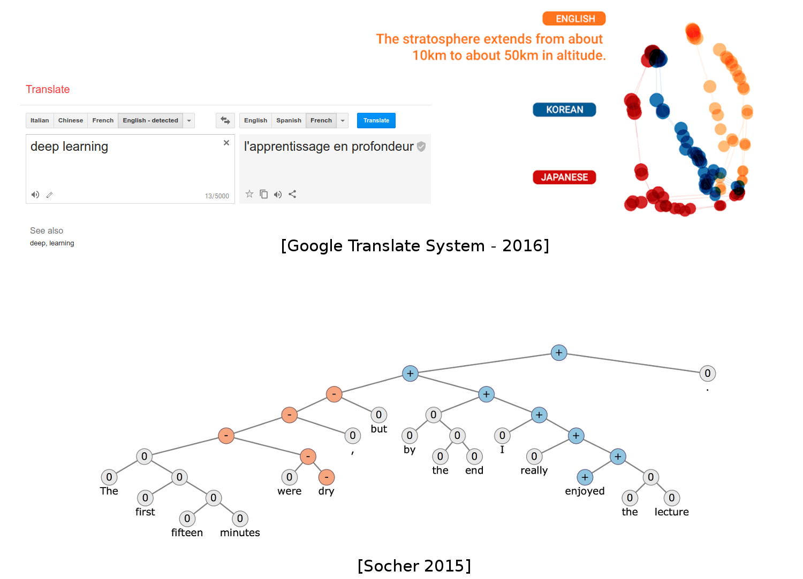
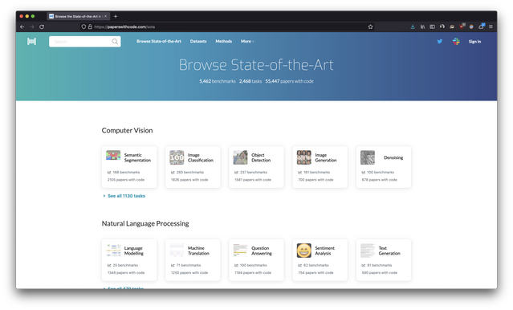

# State of the art in AI

Taken from this excellent course: [Deep Learning Lectures](https://m2dsupsdlclass.github.io/lectures-labs/slides/01_intro_to_deep_learning/index.html)

## Speech to text

Waveform → Text

<figure markdown>
{width=80% .center}
<figurecaption>Waveform → Text</figurecaption>
</figure>

## Computer vision

Image → class

Image → (class, bounding box)

Image → (class, shape)

<figure markdown>
{width=80% .center}
<figurecaption>
Image → class 
Image → (class, bounding box) 
Image → (class, shape)
</figurecaption>
</figure>

Image → (class, shape)

Image → facial landmarks

<figure markdown>
{width=80% .center}
<figurecaption>
Image → (class, shape) 
Image → facial landmarks
</figurecaption>
</figure>

## Natural language processing (NLP)

Text → text (different language)

Text → syntax tree

<figure markdown>
{width=80% .center}
<figurecaption>
Text → text (different language) 
Text → syntax tree
</figurecaption>
</figure>

Text → text (probable short answer)

Text → text (query)

<figure markdown>
{width=80% .center}
<figurecaption>
Text → text (probable short answer) 
Text → text (query)
</figurecaption>
</figure>

## Computer vision & NLP 

Image & text (question) → text (answer)

Image → text (description)

<figure markdown>
{width=80% .center}
<figurecaption>
Image & text (question) → text (answer) 
Image → text (description)
</figurecaption>
</figure>

## Image translation

Image → image (with artifacts)

Image → image styled as the other

Image → Image (higher resolution)

<figure markdown>
{width=80% .center}
<figurecaption>
Image → image (with artifacts) 
Image → image styled as the other 
Image → Image (higher resolution)
</figurecaption>
</figure>

## Audio generation

Waveform → Waveform (continued)

<figure markdown>
{width=80% .center}
<figurecaption>
Waveform → Waveform (continued)
</figurecaption>
</figure>

Guess which one is generated ?

<audio controls>
  <source src="columbia_gen.wav" type="audio/wav">
Your browser does not support the audio element.
</audio>

<audio controls>
  <source src="columbia_gt.wav" type="audio/wav">
Your browser does not support the audio element.
</audio>

## Image generation

Vector (random) → image

<figure markdown>
{width=80% .center}
{width=80% .center}
<figurecaption>
Vector (random) → image
</figurecaption>
</figure>

Text → image

<figure markdown>
{width=80% .center}
<figurecaption>
Text → image
</figurecaption>
</figure>

## Science - Genomics, biology, chemistry, physics

DNA sequence → drug

<figure markdown>
{width=80% .center}
<figurecaption>
DNA sequence → drug
</figurecaption>
</figure>

Protein sequence → folding shape (protein properties)

<figure markdown>
{width=80% .center}
<figurecaption>
Protein sequence → folding shape (protein properties)
</figurecaption>
</figure>

Chemical structure → properties

<figure markdown>
{width=80% .center}
<figurecaption>
Chemical structure → properties
</figurecaption>
</figure>

Incompressible Euler equations (Navier-stokes for fluids) → guess of the solution

100x speedup in solving time

<figure markdown>
{width=80% .center}
<figurecaption>
Incompressible Euler equations (Navier-stokes for fluids) → guess of the solution
</figurecaption>
</figure>

## Gaming

Image sequence → next action

<figure markdown>
{width=80% .center}
<figurecaption>
Image sequence → next action
</figurecaption>
</figure>

## More models and tasks

[Papers with Code - Browse the State-of-the-Art in Machine Learning](https://paperswithcode.com/sota)

<figure markdown>
{width=80% .center}
<figurecaption>
Image sequence → next action
</figurecaption>
</figure>
