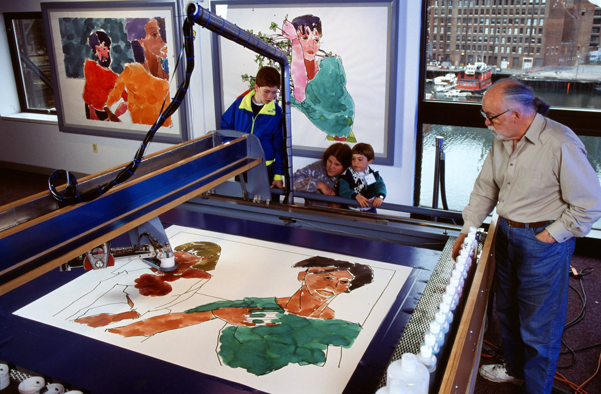

# Bottlenecks for AI

## AI applications: automation everywhere

All activities are susceptible to be automated, if there is enough data to train models.

The automation equation:
<big>🦾 Automation probability = 🎼 Coherence * 📊 Data</big>

- Coherence: similarity between cases, all configurations are known. We can improve coherence by controlling the environment (ex: battery hens, factory, autonomous driving on private property, prefab in construction)
- Data: the less coherent the environment, the more data we need to describe it (e.g.: driving in Florida on a private property, driving in US, driving in Toulouse).

??? Source
    [WORKING PAPER The Future of Employment](https://www.oxfordmartin.ox.ac.uk/downloads/academic/future-of-employment.pdf) & Q.Chenevier's own opinions

## Perception & manipulation

2 unsolved challenges:

- Perception in unstructured environments: houses, fields
- New or irregular objects handling, with a soft grasp and through learning of mistakes

The human hand is a wonderful tool, full of sensors:

- Position
- Toughness / Roughness
- Heat
- Humidity

<figure markdown>
{width=80% .center}
<figurecaption>
Difficult manipulation environment
</figurecaption>
</figure>

<figure markdown>
{width=80% .center}
<figurecaption>
Difficult perception environment
</figurecaption>
</figure>

<figure markdown>
<iframe width="560" height="315" src="https://www.youtube.com/embed/4F-uu8rvgNw?start=1188" title="YouTube video player" frameborder="0" allow="accelerometer; autoplay; clipboard-write; encrypted-media; gyroscope; picture-in-picture" allowfullscreen></iframe>
<figurecaption>
Manipulation learning experiment (from 19:48 to 21:11)
</figurecaption>
</figure>

## Social intelligence

Social intelligence tasks require several hard-to-automate skills:

- Recognize emotions
- Being empathetic with our interlocutor ("compute its state of mind")
- Exploit this context and the past interactions

*"Recognizing emotions is a challenge, but the ability to answer in a smart way to this information is even harder."*

Nevertheless, Woebot Health: Relational Agent for Mental Health, a CBT (Cognitive Behavioral Therapies) chatbot, demonstrates shows that many CBT therapists' sessions could be automated.

It doesn't replace the therapist, but can reduce significantly the needed amount of sessions to do a therapy.

<figure markdown>
{width=80% .center}
<figurecaption>
Woebot health
</figurecaption>
</figure>

## Creative intelligence
## Creative intelligence

Creative intelligence is about creating new ideas which have a creative value. 

Generating novelty is easy, the main challenge is to know how to describe our creative values to encode them in a software.

<figure markdown>
{width=80% .center}
<figurecaption>
AARON by Harold Cohen
</figurecaption>
</figure>

<figure markdown>
<iframe width="560" height="315" src="https://www.youtube.com/embed/2kuY3BrmTfQ" title="YouTube video player" frameborder="0" allow="accelerometer; autoplay; clipboard-write; encrypted-media; gyroscope; picture-in-picture" allowfullscreen></iframe>
<figurecaption>
EMI by David Cope
</figurecaption>
</figure>

<figure markdown>
{width=80% .center}
<figurecaption>
[AIVA](https://creators.aiva.ai/)
</figurecaption>
</figure>

## Demo: Image generation from text

1. Generate your image with [stable diffusion](https://huggingface.co/spaces/stabilityai/stable-diffusion)
1. Inspire from [prompt examples in diffusionDB](https://huggingface.co/datasets/poloclub/diffusiondb) to create your own prompt
1. Go back to step 1 (loop until having a nice result)

<figure markdown>
{width=60% .center}
<figurecaption>
[stable diffusion](https://huggingface.co/spaces/stabilityai/stable-diffusion
</figurecaption>
</figure>

## Image generation from text prompt: explanation

CLIP: image → text

VQGAN: vector → image

VQGAN+CLIP: vector → image → text

The input (vector) is optimized so that the output (text) matches the text prompt 

<figure markdown>
{width=60% .center}
<figurecaption>
</figurecaption>
</figure>
