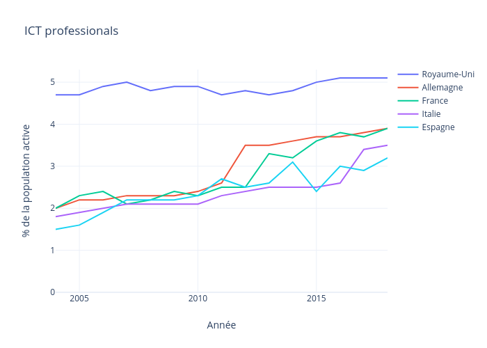

# Introduction

## Envisioning the future

To understand the future, look at weak signals with exponential growths.

What are those weak signals ?

## Cheap computing

Computing power per $ = x2 every 18 months

## Ubiquitous computing

Transistors per human = x10 every 5 years

## Growing data

Data stored = x5 every 4 years

400 exaBytes = 40 GB/human

40 000 exaBytes = 4 TB/human

## Slow growth of IT jobs

Slow growth of number of technologists in the population.

Non-exponential !

## Big data is eating the world

IT & Engineering departments are forced to get into cloud, big data and machine learning.

## Information value

A weather forecast is not valuated the same by a citizen and by a wine producer.

The assessment of oil reserves is not valuated the same by a citizen and by a trader on the commodity market.

AI creates information which is valorized through decisions.

You can't leverage AI without understanding decision making !

<big>**📊 Information + ✋ Decision = 💰 Value**</big>
