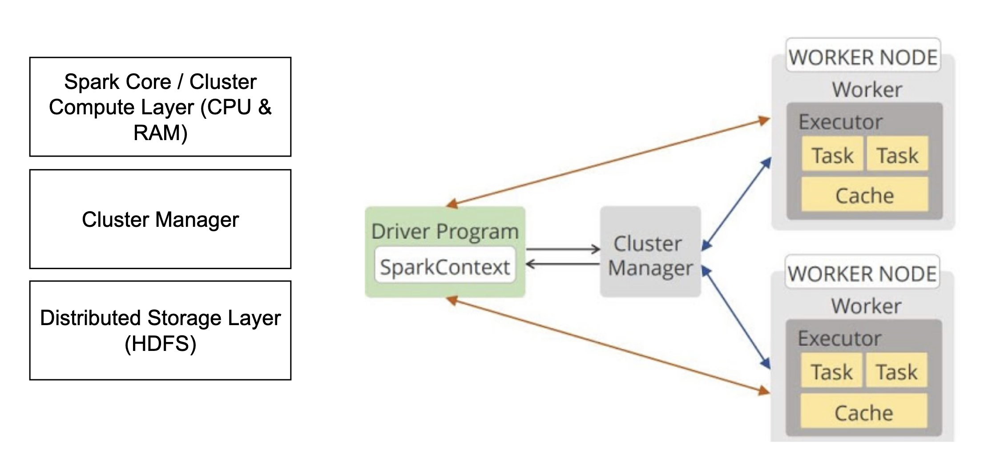
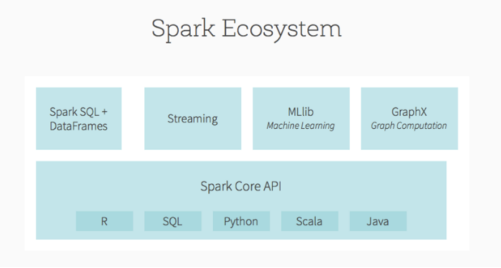
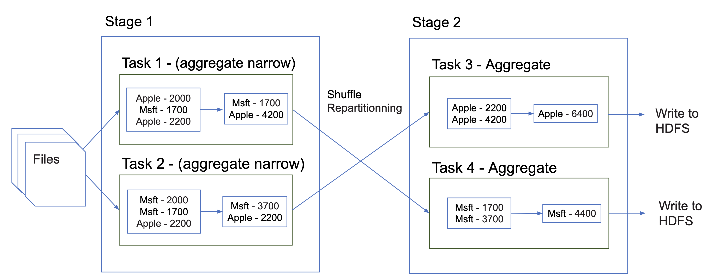
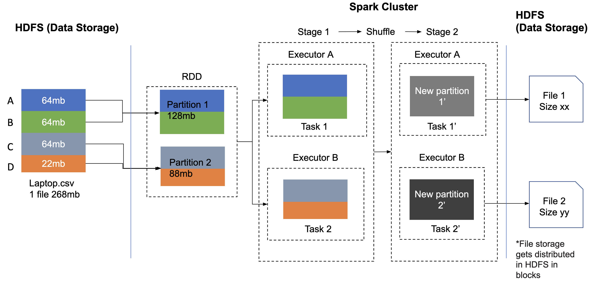

# Transforming data at scale

Example with Spark

## The challenge of distributed computation

- Distributed computation allows for increased computation speed
- Several machine work in parallel on a given job and data is spread across nodes/machines (horizontal scaling)
- When data gets bigger, you don’t necessarily need more memory / CPU on each node but you can spin up more nodes
- This comes at a cost: there is a close relationship between the logic executed and the physical distribution 

## What is Spark?

- Spark is a big data analytics engine siting above a distributed data store where data can be loaded in memory, distributed and analyzed in parallel across the nodes of the cluster
- Spark sits on top of:
  - A distributed file system (usually HDFS or other commercial implementation of it such as AWS S3) 
  - A resource manager that is going to manage cluster resources (YARN, Apache Mesos, etc.). Resource manager allocation is usually dynamic and cluster scaling is static (in a cluster, the RM solves the problem of: optimally distribute 256v Cores and 256Gbs of RAMs to 3 jobs)
  - [Not covered but nice to know] Increasingly clusters are managed through containerization with Kubernetes; Kubernetes can spin up container to execute spark jobs. This provides increased ability to isolate jobs (increased security), resources and enable auto scaling (in the cloud). This makes it possible to make resource allocation static but cluster scaling dynamic.

## Spark infrastructure

<figure markdown>

<figcaption>Spark infrastructure</figcaption>
</figure>

## Interacting with data through Spark

<figure markdown>

<figcaption>Spark APIs</figcaption>
</figure>

- Spark works conceptually similarly to MapReduce (which is part of the Hadoop ecosystem) but it runs in memory which makes it 100x faster. It progressively replace MapReduce. 
- Apache Spark Core APIs are: R, SQL, Python, Scala and Java (PySpark will illustrate a few examples) 
- Apache Spark provides a set of 3 abstractions to work with data, from the lowest to the higher level of abstraction:
  - Resilient Distributed Dataset (Lowest level API, fundamental abstraction),
  - Dataframe
  - Datasets

## Few things about Resilient Distributed Dataset

- Spark doesn’t see the world in terms of files, it reads them and create RDD from it (=! from HDFS storage, RDDs don’t work with the files stored in HDFS, it reads them and creates RDD from it)
- An RDD is a group of data elements called partitions that can be queued for parallel tasks.
- Spark cannot parallelize computation inside partitions --> they are the atom of the compute job
- You can think of an RDD as a logical listing of data location on the cluster (i.e. which partition is where in memory)
- RDDs are resilient & immutable: as you transform data and RDD and go from A to B, a ”recipe” of the transformation is created so that if something goes wrong, you can recreate your RDD at any point in time
- Gives you flexibility on schema / typing but it requires better coding ability vs higher level APIs. It can cause some inefficiencies as Spark won’t optimize things for you.

## Dataframes and Datasets APIs

- When coding in pySpark of Spark SQL, you generally don’t directly handle RDD, you handle dataFrames or datasets, handling RDD is done under the hood by Spark for you.

- DataFrames are an abstraction of RDD, it only works with structured and semi-structured data. DataFrames are organized into named columns and are the conceptual equivalent of tables in a relational database. It allows Spark to manage schema.

- Spark provides a rich API to interact with DataFrames which enables Spark to perform extra optimization under the hood for you

## How Spark parallelizes computation

<figure markdown>

<figcaption>Spark job parallelism</figcaption>
</figure>

- Spark job is split into stages 
- Each stages process a list of tasks which are performed by Executors in memory
- Tasks are mapping 1:1 with RDD partitions, this is what gets parallelized

## Example of processing

| Username           | Model                | Make      | Price |
|--------------------|----------------------|-----------|-------|
| Nicolas Daveau     | Macbook Pro 15' 2018 | Apple     | 2200$ |
| Quentin Chenevier  | Surfacebook 2019     | Microsoft | 1700$ |
| Laurent Lapasset   | Macbook Pro 13' 2019 | Apple     | 1400$ |
| ...                | ...                  | ...       | ...   |

```python
import spark.sql.functions as F

df = df.groupBy("Make").agg(F.sum("Price")) 
```

<figure markdown>

<figcaption>Spark logical plan example</figcaption>
</figure>

<figure markdown>

<figcaption>Spark physical plan example</figcaption>
</figure>

## Types of operations: Is it wide ?
- Filter
- Aggregate
- Windowing
- Cast type
- Join
- Explode
- Column concatenation
