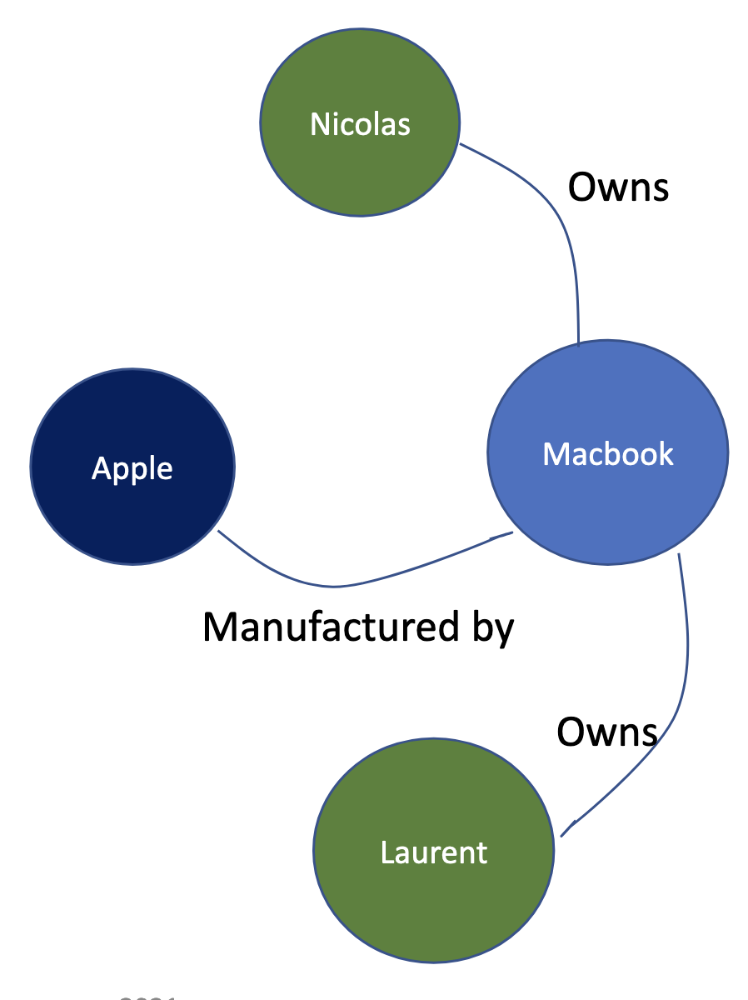

# Databases types (SQL / NoSQL)

## Different types of databases systems: SQL vs NoSQL

<figure markdown>

<figcaption>SQL vs NoSQL databases</figcaption>
</figure>

- Relational databases are less suitable for horizontal scaling than NoSQL databases 
  - Joins become very inefficient when performed across nodes and difficulty to keep ACID (Atomic, Consistent, Isolated, Durable) guarantees while ensuring all replicas have fresh data
  - READ can scale easily, EDIT is more challenging. Think of ensuring the integrity of a transaction (locking a row to ensure no concurrent access happens) if a data is being stored on multiple nodes/servers
- NoSQL are giving up on a number of requirements, are easier to scale horizontally (less immediate consistency, data freshness and accuracy in order to gain other benefits, like scale and resilience). NoSQL are designed to ensure high availability across cluster which means consistency/durability can be sacrificed to some degree

## ACID & BASE properties

<figure markdown>

<figcaption>ACID & BASE properties</figcaption>
</figure>

ACID:

- **Atomicity** : means that you guarantee that either all of the transaction succeeds or none of it does. 
- **Consistency** : All clients see the same data at the same time . Data will be valid according to all defined rules, including any constraints, cascades, and triggers that have been applied on the database. 
- **Isolation** No transaction will be affected by any other transaction. So a transaction cannot read data from any other transaction that has not yet completed.
- **Durability** means that, once a transaction is committed, it will remain in the system – even if there’s a system crash immediately following the transaction. Any changes from the transaction must be stored permanently. 

BASE:

- **Basically Available**: Data are available as prescribed by the CAP theorem (Consistency, Availability, Partitioning Tolerance, chose 2 only). Query response can be inaccurate but system availability guaranteed
- **Soft state**: Data consistency is developer managed
- **Eventually consistent**: Data can be inconsistent at time t but converges towards consistency

## SQL: example RDBMS

Users table:

| User_id | User              | Material Id |
|---------|-------------------|-------------|
| 1       | Nicolas Daveau    | 1           |
| 2       | Quentin Chenevier | 2           |
| 3       | Laurent Lapasset  | 3           |

Laptop inventory table:

| Material id | Model                | Make      |
|-------------|----------------------|-----------|
| 1           | Macbook Pro 15' 2018 | Apple     |
| 2           | Surfacebook 2019     | Microsoft |
| 3           | Macbook Pro 13' 2019 | Apple     |

- Data is organized in 2 dimensional tables interlinked by relations.
- **Advantages**: transparent data structure, Structured Query Language, major RDBMSs adhere to ACID 
- **Disadvantages**: Scalability issues, challenge to handle large amount of data
- **Applications**: transactional system/workflows requiring high level of integrity / consistency
- **Example of technos**: AWS DynamoDB, Voldemort, Oracle NoSQL Database

## CAP Theorem

<figure markdown>

<figcaption>CAP Thorem</figcaption>
</figure>

CAP theorem: "You can only pick two":

- **CP Category**: There is a risk of some data becoming unavailable.
- **CA Category**: Network problem might stop the system
- **AP Category**: Clients may read inconsistent data

## NoSQL: Example key-value database

| Key    | Value                                                                                   |
|--------|-----------------------------------------------------------------------------------------|
| User_1 | `{"name": "Nicolas Daveau", "laptop":"Macbook Pro 15' 2018", "make": "Apple"}`          |
| User_2 | `{"name": "Quentin Chenevier", "laptop":"Surfacebook 2019", "make": "Microsoft"}`       |
| User_3 | `{"name": "Laurent Lapasset", "laptop":"Macbook Pro 13' 2019", "make" : "Apple"}`       |

- Data is stored in key/value pairs 
- **Advantages**: Schema-less way and is very efficient for read and write operations. Efficient in dealing with high load, values can be stored in the form of a JSON blob, a string, etc.
- **Disadvantages**: Not optimized for lookups (need to scan whole collection) and a parser is needed to store multiple values 
- **Applications**: storing users preference for a website, storing a shopping cart, real time adds recommendations
- Example of technos: AWS DynamoDB, Voldemort, Oracle NoSQL Database

## NoSQL: Example Column Oriented Database

| ID | Name              |
|----|-------------------|
| 01 | Nicolas Daveau    |
| 02 | Quentin Chenevier |
| 03 | Laurent Lapasset  |

| ID | Model                |
|----|----------------------|
| 01 | Macbook Pro 15' 2018 |
| 02 | Surfacebook 2019     |
| 03 | Macbook Pro 13' 2019 |

| ID | Make      |
|----|-----------|
| 01 | Apple     |
| 02 | Microsoft |
| 03 | Apple     |

- Every column is treated separately. Values of single column databases are stored contiguously.
- **Advantages**: Very efficient for reading and aggregating data (Sum, Mean, etc.) because no need to read all columns. 
- **Disadvantages**: Less efficient for writing tuples 🡪 requires multiple accesses. 
- **Applications**: column-based NoSQL databases are widely used to manage data warehouses, business intelligence, CRM, etc.
- **Example of technos**: HBase, Cassandra, Google big tables

## NoSQL: Example Document Oriented Database

| Document 1 |
| -----------|
| `{"name": "Nicolas Daveau", "laptop": "Macbook Pro 15’ 2018", "make": "Apple"}` |

| Document 2 |
| -----------|
| `{"name": "Quentin Chenevier", "laptop": "Surfacebook 2019", "make": "Microsoft"}` |

| Document 3 |
| -----------|
| `{"name": "Laurent Lapasset", "laptop": "Macbook Pro 13’ 2019", "make" : "Apple"}` |

- Data is retrieved as key value pair but the value part is stored as a documents. Documents are usually stored in a semi-structured data formal like JSON or XML.
- **Advantages**: schema less and flexible, ease to integrate additional information with low maintenance burden.
- **Disadvantages**: managing relationships between document is cumbersome, aggregations can also be more complex to handle
- **Applications**: Yelp / Tripadvisor type of use cases, book database, etc.
- **Example of technos**: MongoDB, Marklogic, Amazon DocumentDB

## Example Graph Oriented Database

<figure markdown>
{width="300"}
<figcaption>Graph database example</figcaption>
</figure>

- A graph database stores entities as nodes and the relationships are represented through edges of the graph. Every node has a unique identifier.
- **Advantages**: Graph databases are by nature multi-relational and loosely connected. Traversing relationships is fast as it is captured into the data storage. Well suited for powering analytics (similarity analytics, etc.)
- **Disadvantages**: Difficult to scale on large amount of data (difficult to scale horizontally), queries can be very expensive, no uniform query language.
- **Applications**: Social network analytics, logistics, semantics search, intelligence, fraud detection.
- **Example of technos**: Neo4J, Infinite Graph, OrientDB

