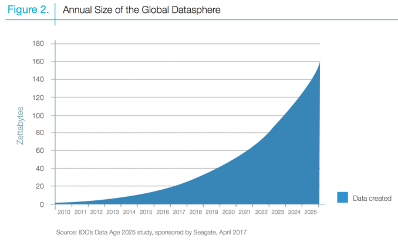

# Context

## Digitalization

### Networking

Cloud computing 
Broadband 
Mobile internet

### Digital data & Customer access

Internet of Things (IoT) and wearables
Big data analytics technologies 
Social networks

### Automation

Robotics (drones, etc.)
Additive layer manufacturing
Sensor technologies

## Size of data sphere grows

- Upward trend in data being collected and owned across the board (connected products, wireless broadband technologies, etc.)
- Data growth and ownership is unequally distributed (e.g. consumer internet vs non-digital native companies)

## One definition of big data

> Big data is high-**V**olume, high-**V**elocity and/or high-**V**ariety information assets that demand cost-effective, innovative forms of information processing that enable enhanced insight, decision making, and process automation.

_**Gartner**_

## What is a (big) data problem? 

- Better marketing and segmentation
- Early detection of quality defects in industry (automotive, aerospace, etc.)
- Anti money laundering activity in financial services
- Supply chain and logistics disruption management
- Measuring CO2 footprint with data 
- COVID-19 response (medical supply chain, hospitals capacity management)
- Law enforcement, counter terrorism, counter narcotics, etc.

