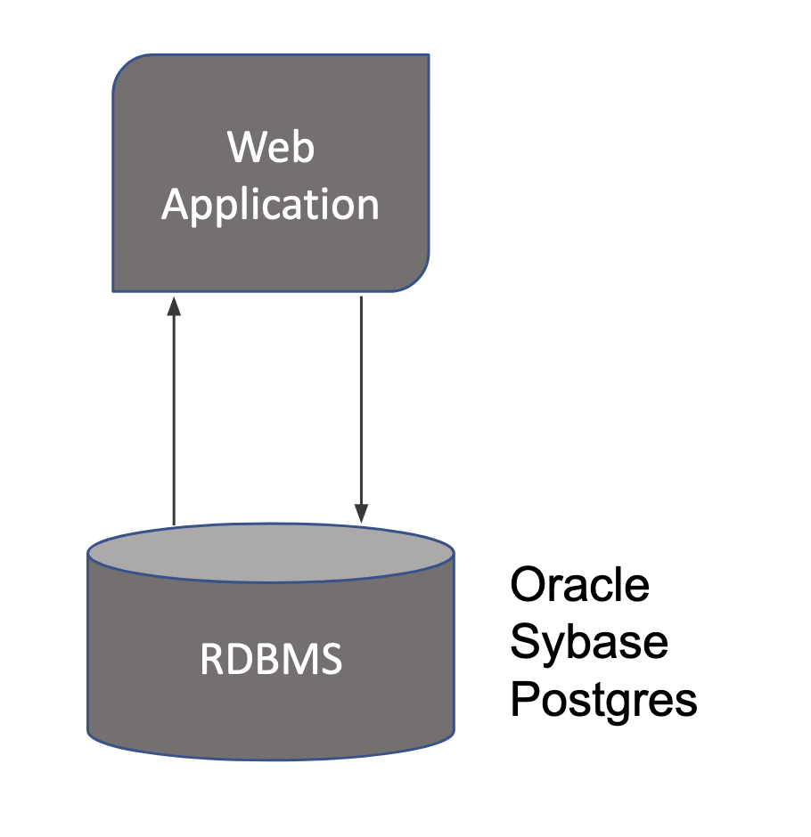
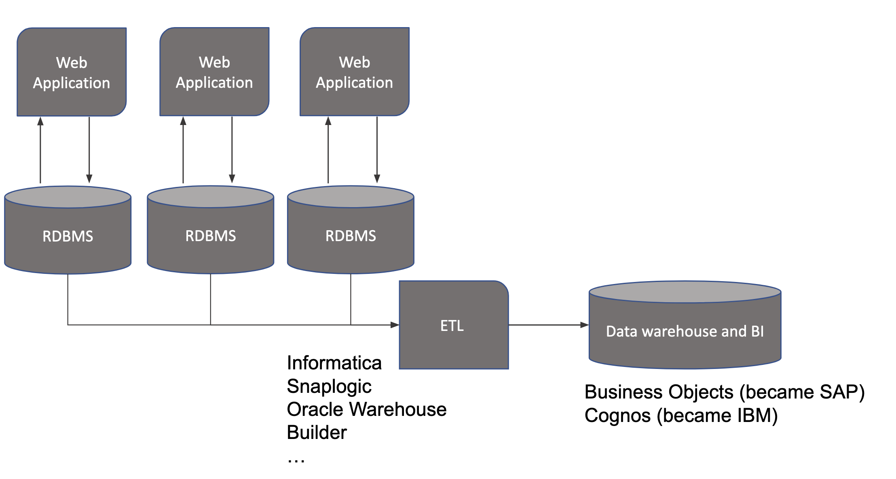
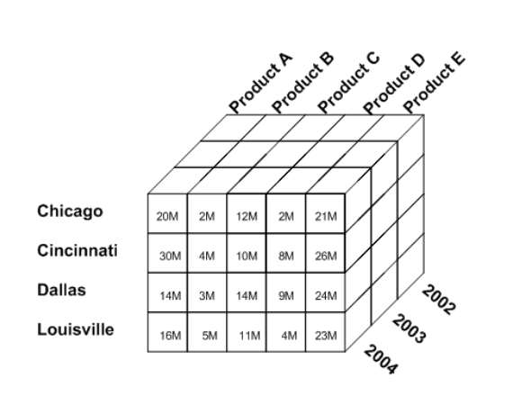
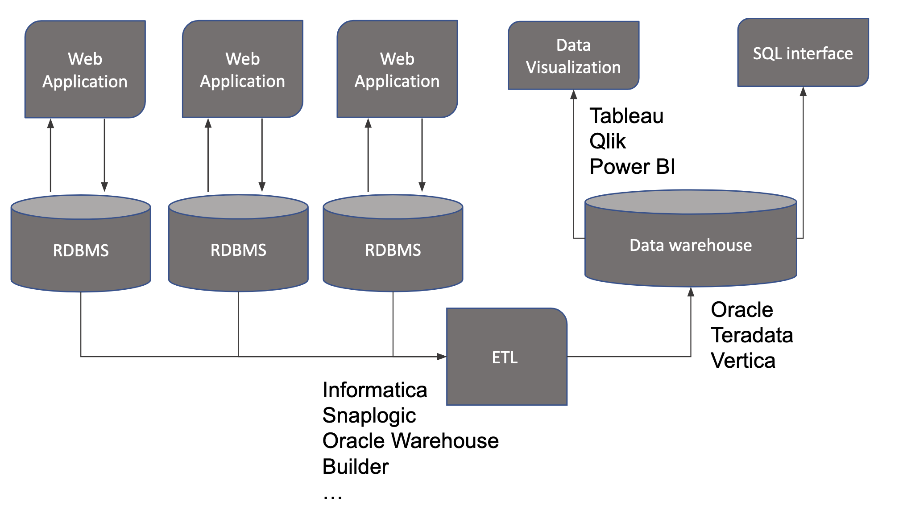
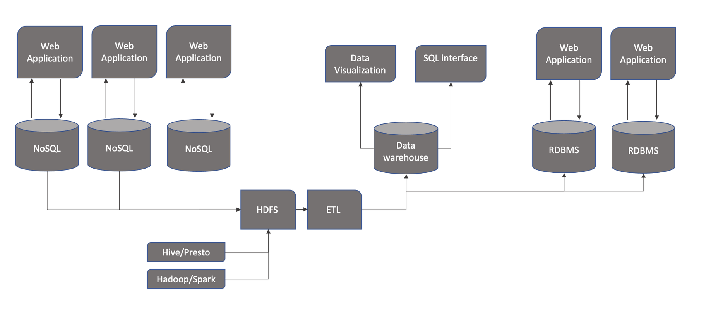
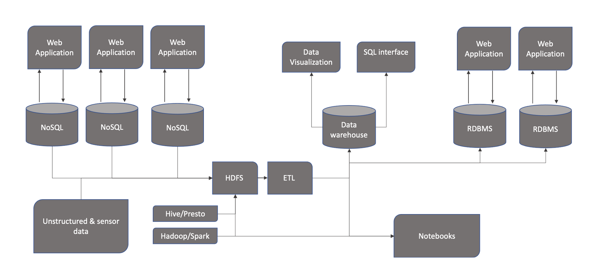
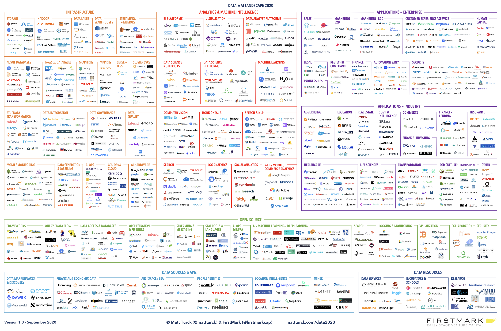
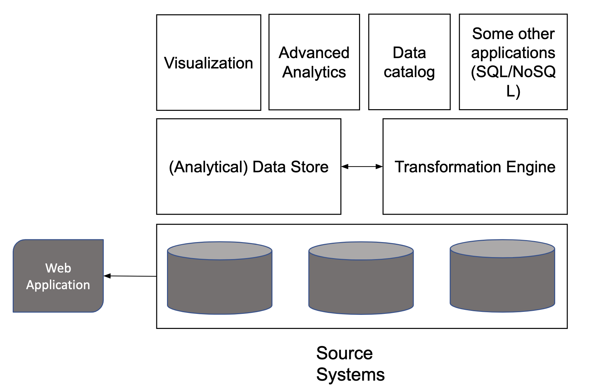

# Data processing history

## Mid 1990s

<figure markdown>
{ width="300" }
<figcaption>Data infrastructure in the mid 1990s</figcaption>
</figure>

- Web application writes to an Relational Database Management System (very good at transactional processing)
- Example of transactional processing: 
  - conceptually think of an ATM (Auto Teller Machine) where you are mostly concerned about integrity. In that case the transaction is a single event where something get subtracted at one place and added to another place
- Very good to power application on the web but less good for powering analytics at scale (with multiple RDBMSs and web applications)

## Early 2000s

<figure markdown>

<figcaption>Data infrastructure in the early 2000s</figcaption>
</figure>

- ETL = Extract, Transform and Load. It extracts data from RDBMS or transactional system, transform it through more or less complex business logics (aggregations, filters, joins, etc.) and loads it into a data warehouse or BI (business intelligence) tool. 
- Example: think of a user facing application relying on a transactional system for managing trips reservations. If you want to see historical trends of bookings, prices at different point in time, you need to collect snapshots of the data everyday that were present, you can use an ETL + BI processing. 
- Data stored in the form of cubes of data to make processing faster but scaling issues at some point in time. Difficulties to handle high loads 

<figure markdown>
{ width="300" }
<figcaption>Schema of a data cube</figcaption>
</figure>

## Late 2000s

<figure markdown>

<figcaption>Data infrastructure in the late 2000s</figcaption>
</figure>

- Data warehouses systems like Vertica or Teradata where build to write SQL like queries to data
- Not real strong visualization tools with these data warehouse systems 
- Tableau and others came in to provide a visualization layer on top of data warehousing technologies

## And then...

<figure markdown>

<figcaption>The growing trend of big data (source: Google trends)</figcaption>
</figure>

- Explosion of volumes of data in general
- Explosion of unstructured data (images, video, audio, etc.) 
- Limits of existing stack required new technologies including (not limited to)
- NoSQL storage (better suited for large amount of data)
- Distributed storage (HDFS)
- Parallel computation frameworks (Hadoop / Spark)

## Mid 2010s

<figure markdown>

<figcaption>Data infrastructure in the mid 2010s</figcaption>
</figure>

- Data warehouses had difficulty to scale with very high loads. 
- Google realized early the limits of vertical scalability. HDFS came in with possibility to scale horizontally with the possibility to distribute load across multiple machine.
- HDFS could be interrogated using Hive/Presto types of framework 
- Hadoop and Spark used for computation transformation at scale

## Now (2020s)

<figure markdown>

<figcaption>Data infrastructure in the 2020s</figcaption>
</figure>

- Massive amount of unstructured and sensor data
- General complexification of the landscape 
- Notebooks became very popular and data scientist came into the picture. 
- Notebook is probably the most popular interface data scientists use to train ML models 
- Multiple roles in the organization to make it work

## What the world looks like

<figure markdown>

<figcaption>Big data landscape in 2020</figcaption>
</figure>

> Note: never use this landscape as it was a peer-reviewed source of truth.

## Generic data stack

<figure markdown>

<figcaption>Generic data stack</figcaption>
</figure>

- You will find very complex descriptions of data stacks but most data ecosystems are boiling down to a flavor of that architecture
- Large commercial offerings can cover and traverse the layers on that slide (e.g. AWS, Microsoft, Google Cloud)
- The (Analytical) data store block can be pretty thick and involve different techno/applications (from resource management, data storage, orchestration, batch and real time ingestion to some analytical capabilities)
- In this course we will make a focus on data storage (HDFS) and transformation engine (with Spark)
