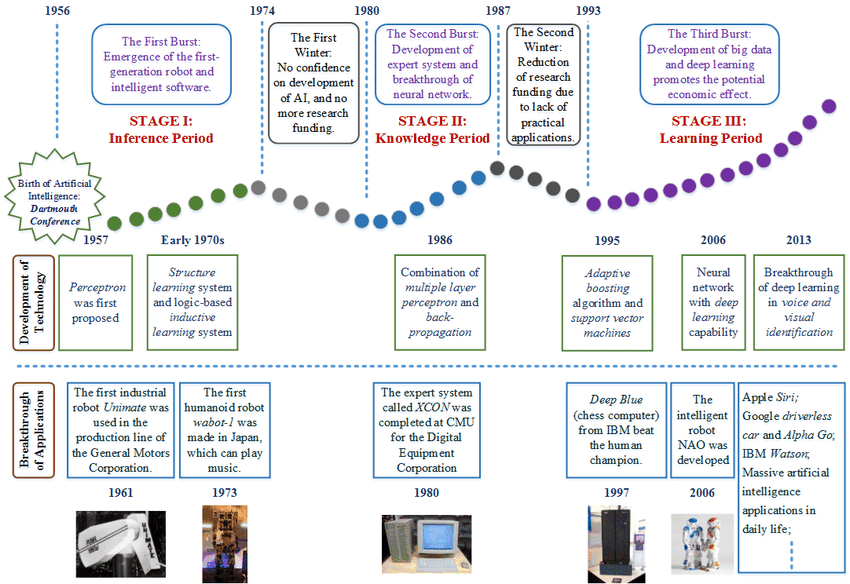
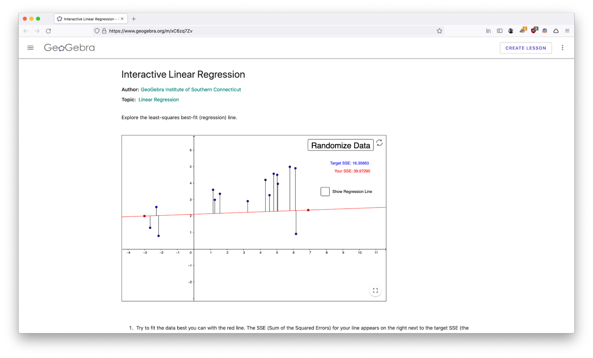
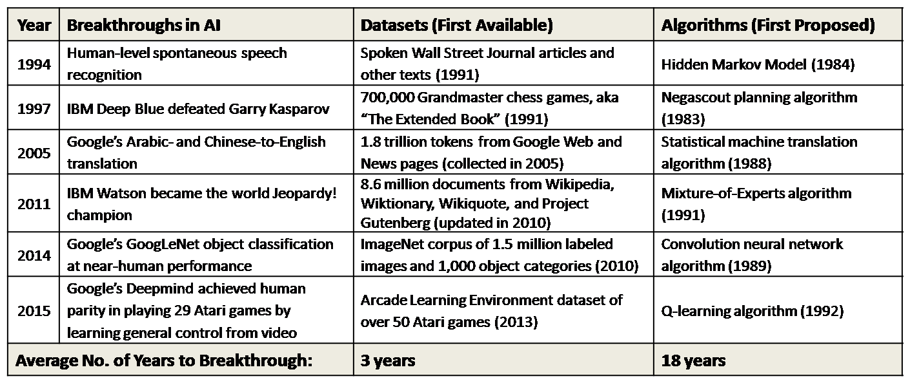
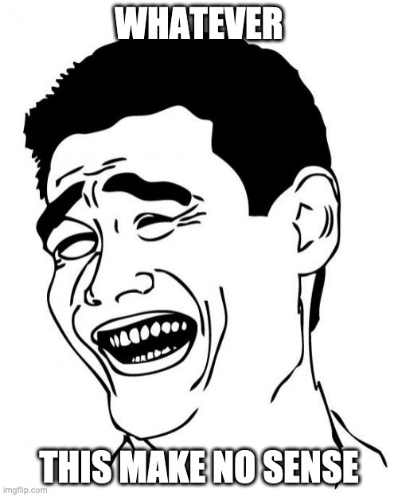
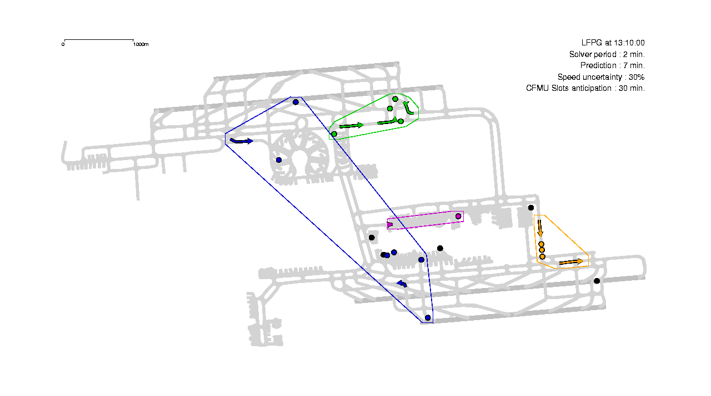

# What is AI

## The 3 eras of AI

AI has embraced very different technologies during its history:

1. **classical code**
    if → then → else
1. **expert system**
    using human-made rules
1. **statistical algorithms**
    machine learning the rules

<figure markdown>
{width=80% .center}
<figurecaption><small>Source: [State-of-the-Art Mobile Intelligence (research paper)](https://www.researchgate.net/publication/323591839_State-of-the-Art_Mobile_Intelligence_Enabling_Robots_to_Move_Like_Humans_by_Estimating_Mobility_with_Artificial_Intelligence)</small></figurecaption>
</figure>

## AI is machine learning

Knowledge is extracted from data. Machine learning is a combination of:
- statistical algorithms
- systematic experimental process

Basically, it's experimentation with algorithms.

<figure markdown>
{width=50% .center}
<figurecaption><small>Source: [xkcd](https://xkcd.com/1838/)</small></figurecaption>
</figure>

## Principles of machine learning

The model computes predictions. E.g:
- linear regression
- decision trees
- SVM
The optimizer tunes the model to reduce the prediction error. E.g:
- gradient descent
- genetic algorithms

<figure markdown>
{width=80% .center}
<figurecaption><small>Source: [From Linear Regression to Deep Learning in 5 Minutes](http://www.deepnetts.com/blog/from-linear-regression-to-deep-learning-in-5-minutes.html)</small></figurecaption>
</figure>

## Differentiable programming

Machine learning by gradient descent is an optimisation of a differentiable function:
- A differentiable function allows to compute the error gradient
- Each iteration, the gradient shows how to modify the model parameters to reduce the error.

<figure markdown>
{width=80% .center}
<figurecaption><small>Source: [Linear Regression by using Gradient Descent Algorithm: Your first step towards Machine Learning (medium)](https://medium.com/meta-design-ideas/linear-regression-by-using-gradient-descent-algorithm-your-first-step-towards-machine-learning-a9b9c0ec41b1)</small></figurecaption>
</figure>

??? note
    If the function we want to optimize is not differentiable, we use other optimization algorithms (such as random search, genetic algorithms, bayesian optimization, ...), it is then called *black box optimization*.

## Demo: Interactive linear regression

[👉 Interactive linear regression – GeoGebra](https://www.geogebra.org/m/xC6zq7Zv)

<figure markdown>
{width=80% .center}
<figurecaption><small>Source: [Interactive linear regression – GeoGebra](https://www.geogebra.org/m/xC6zq7Zv)
</small></figurecaption>
</figure>

## The deep learning revolution

Simple models (neurons) are combined together to create a complex model.

<figure markdown>
{width=80% .center}
<figurecaption><small>Source: [News Feature: What are the limits of deep learning? (PNAAS)](https://www.pnas.org/content/116/4/1074)</small></figurecaption>
</figure>

## Why deep learning is big deal 

👍 Less preprocessing & feature engineering

👎 Needs much more data 💾 and computing 🥵

<figure markdown>
{width=80% .center}
<figurecaption><small>Source: [Blue Hexagon](https://bluehexagon.ai/blog/what-is-deep-learning-and-how-is-it-different-from-machine-learning/)</small></figurecaption>
</figure>

## Demo: Image classification

[Teachable machine - image model](https://teachablemachine.withgoogle.com/train/image)

<figure markdown>
{width=80% .center}
<figurecaption><small>Source: [Teachable machine - image model](https://teachablemachine.withgoogle.com/train/image)</small></figurecaption>
</figure>

## But deep learning is superficial

Deep learning is cool, but you can't deliver without mastering:
- data collection
- data storage
- data cleaning & preparation
- feature engineering
- simple ML algorithms

Deep learning is less than 5% of data projects in industry.

<figure markdown>
{width=80% .center}
<figurecaption><small>Source: [The AI Hierarchy of Needs](https://hackernoon.com/the-ai-hierarchy-of-needs-18f111fcc007)</small></figurecaption>
</figure>

## Data is the enabler

AI breakthroughs happen thanks to:
- Old algorithms
- New datasets

Data is the true enabler of AI research breakthroughs.

<figure markdown>
{width=80% .center}
<figurecaption><small>Source: [Datasets Over Algorithms (kdnuggets)](https://www.kdnuggets.com/2016/05/datasets-over-algorithms.html)</small></figurecaption>
</figure>

## Careers in big data & AI

<figure markdown>
{width=80% .center}
<figurecaption><small>Source: </small></figurecaption>
</figure>

<figure markdown>
{width=80% .center}
<figurecaption><small>Source: </small></figurecaption>
</figure>

<figure markdown>
{width=80% .center}
<figurecaption><small>Source: </small></figurecaption>
</figure>

<figure markdown>
{width=40% .center}
<figurecaption><small>Source: </small></figurecaption>
</figure>

Forget the ambiguous job names, focus on skills. What are the skills mentioned in a job description ?

## AI Applications in civil aviation

Air traffic conflict detection & resolution

<figure markdown>
{width=60% .center}
<figurecaption>
Air traffic conflict detection & resolution
</figurecaption>
</figure>

Aircraft taxi routing

<figure markdown>
{width=60% .center}
<figurecaption>
Aircraft taxi routing
</figurecaption>
</figure>

ATM workload forecast & ATM sector management

<figure markdown>
{width=60% .center}
<figurecaption>
ATM workload forecast & ATM sector management
</figurecaption>
</figure>

Air traffic planification

<figure markdown>
{width=60% .center}
<figurecaption>
Air traffic planification
</figurecaption>
</figure>

??? note "Links to ENAC/OPTIM team research works"
    - [ENAC/OPTIM – Conference papers](https://haltools.archives-ouvertes.fr/Public/afficheRequetePubli.php?idHal=nicolas-couellan%3Bsonia-cafieri%3Bmarcel-mongeau%3Bdaniel-delahaye%3Bmohammed-sbih%3Balexandre-gondran%3Bdavid-gianazza%3Brichard-alligier%3Bcyril-allignol%3Bnicolas-barnier%3Bnicolas-durand%3Bmurat-bronz%3Bthierry-miquel%3Bantoine-drouin%3Bjean-philippe-condomines%3Bcatherine-mancel%3Bgautier-hattenberger%3Bjean-baptiste-gotteland%3Bandrija-vidosavljevic&typdoc=(%27COMM%27)&CB_auteur=oui&CB_titre=oui&CB_article=oui&CB_DOI=oui&CB_typdoc=oui&langue=Anglais&tri_exp=typdoc&tri_exp2=annee_publi&tri_exp3=auteur_exp&ordre_aff=AT&Fen=Aff&css=../css/VisuRubriqueEncadre.css)
    - [ENAC/OPTIM – Publications](http://optim.recherche.enac.fr/?page_id=81)
