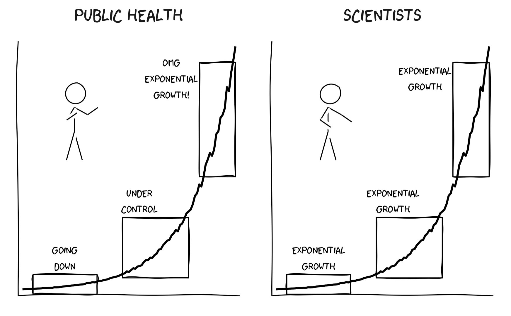
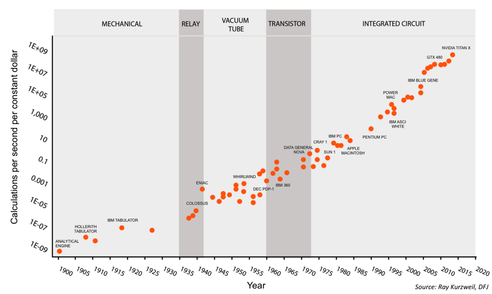
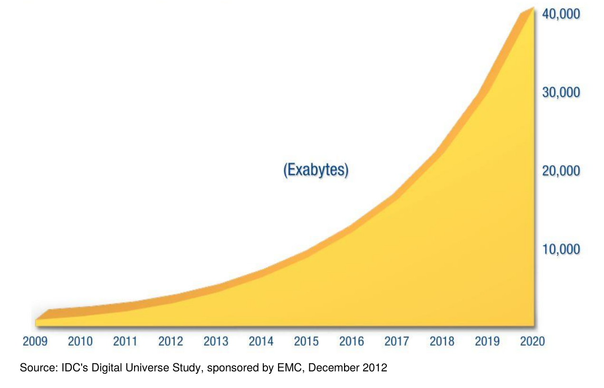

class: center, middle

# 1 &nbsp; Introduction

Short description goes here

---
# 1 &nbsp; Introduction

### 1 &nbsp; Why data is eating the world
### 2 &nbsp; What is AI
### 3 &nbsp; Who makes AI
### 4 &nbsp; State of the art in AI
### 5 &nbsp; Not yet state of the art in AI
### 6 &nbsp; Applications in civil aviation

---
# 1 &nbsp; Introduction

### 1 &nbsp; Why data is eating the world

#### Envisioning the future
#### Cheap computing
#### Ubiquitous computing
#### Growing data
#### Slow growth of IT workers
#### Big data is eating the world
#### Value through decision-making

---
layout:true
.chapter-reminder[#### 1 &nbsp;  Why data is eating the world]

---
# Envisioning the future

.columns[
.forty.padright[
To understand the future, look at weak signals with exponential growths.

What are those weak signals ?
]
.sixty.padleft[
]

]

---
# Cheap computing
.columns[
.forty.padright[
Computing power per $ =  
x2 every 18 months
]
.sixty.padleft[

]
]

---
# Ubiquitous computing

.columns[
.forty.padright[
Transistors per human =  
x10 every 5 years
]
.sixty.padleft[

]
]

---
# Growing data

.columns[
.forty.padright[
Data stored =  
x5 every 4 years

400 exaBytes = 40 GB/human  
40 000 exaBytes = 4 TB/human]
.sixty.padleft[

]
]

---
# Slow growth of IT jobs

.columns[
.forty.padright[
Slow growth of number of technologists in the population.

Non-exponential !
]
.sixty.padleft[

]
]

---
# Big data is eating the world

.columns[
.forty.padright[
IT & Engineering departments are forced to get into cloud, big data and machine learning.
]
.sixty.padleft[

]
]

---
# Information value

.columns[
.fifty.padright[
A weather forecast is not valuated the same by a citizen and by a wine producer.

The assessment of oil reserves is not valuated the same by a citizen and by a trader on the commodity market.

AI creates information which is valorized through decisions.

You can't leverage AI without understanding decision making !
]
.fifty.padleft.center[
## 📊 Information  +  ✋ Decision  =  💰 Value
]
]

---
layout:false
class: center middle
# Chapter 2

#### Subchapter 2.1

---
layout:true
.chapter-reminder[#### Chapter 2]

---
# Subchapter 2.1

Slide content goes here
